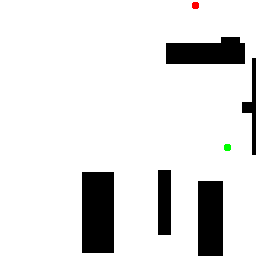
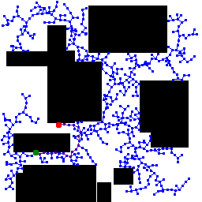
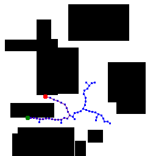
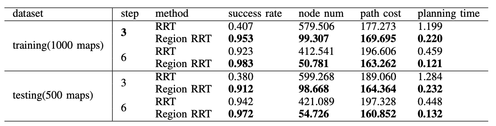

# region_guided_RRT
Region-Guided Rapidly Exploring Random Tree for Sampling-based Path Planning.
We defined a region with high value
and increase the probability of sampling in this region. After
exploring the high-value region, we increase the probability of
sampling towards the destination.
```
# environment
torch
```

```
# map generate
run map_gen.ipynb
```

```
# training
python FCN.py
```

```
# region-rrt test
python main.py
```
map



region


RRT



 Region_RRT



performance



